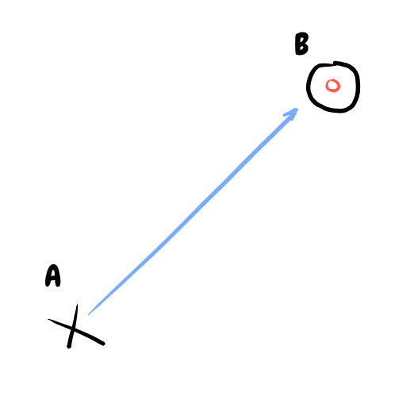
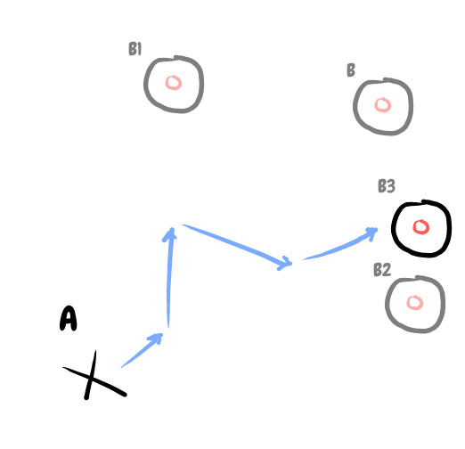
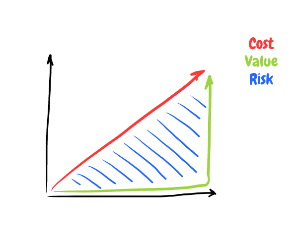
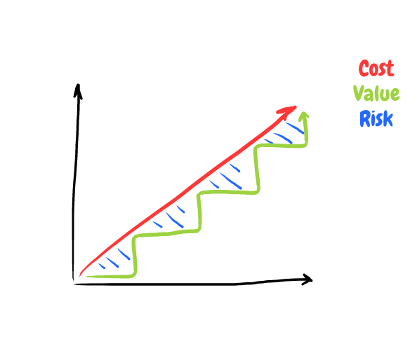
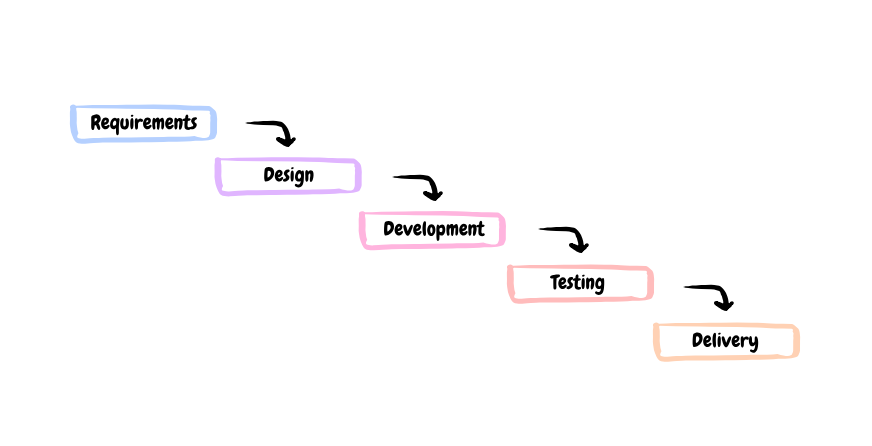
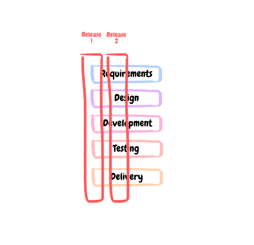
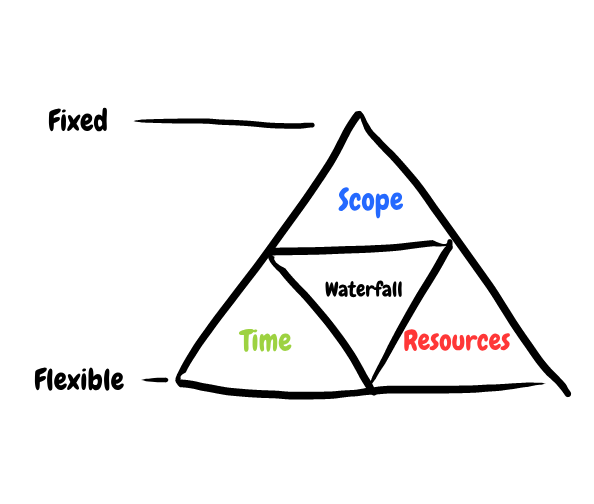
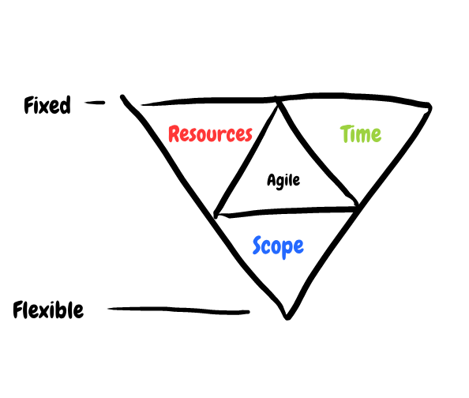

Waterfall | Agile
----------|-------------
Waterfall uses a deterministic approach (cause and effect), with the belief that there is certainty around the end-target (B) and we know how to get there e.g. if we do 'A' we can reach 'B'  | Agile assumes we don't know what the end-target looks like or how exactly to get there. It uses an emprical approach to reduce uncertainty.
Waterfall employs a 'Big Bang' approach. Value is not delivered to the customer until the very end, and everything is given at once. The longer the project the more risk is accrued that what is delivered might not be so valuable afterall.  | Agile works in iterative iterations, delivering smaller chunks of value more frequently to reduce risk and adjust course accordingly. 
Waterfall uses phase-gates, where large batches are executed and handed over to the next stage once sign-off is given. Research from Mary and Tom Poppendieck indicates that up to 50% of knowledge is lost with every hand-over.  | The idea behind agile iterations is to cut batch size down and release early and frequently. Who knows, after a few releases you might realize that many initial 'requirements' are unecessary! 
Scope in waterfall is usually fixed from the very beginning (often within a contract), therefore the only flexible parts of a project are time and resources, which are often flexed if/ when the project is set to miss its deadline.  | Agility uses time and resources as constants, and scope as variable. This means if a deadline is approaching, instead of extending it the scope is revised and the less important features are dropped. 
